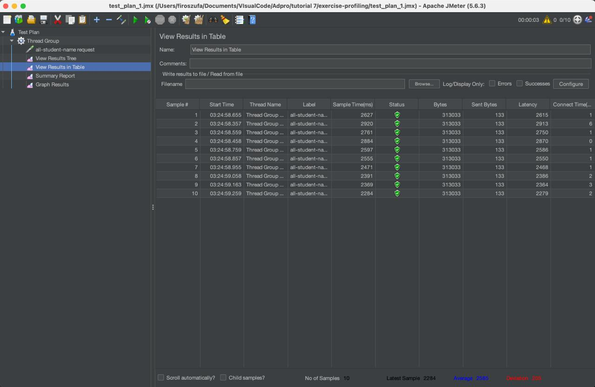
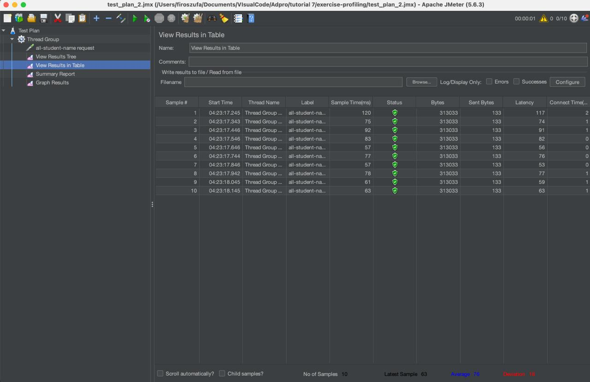
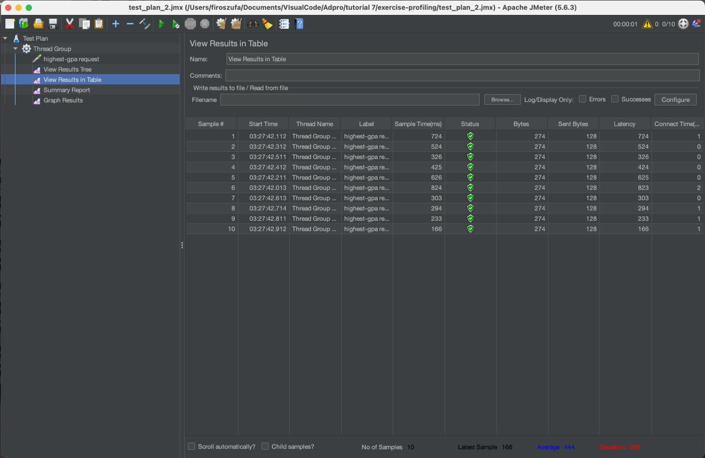
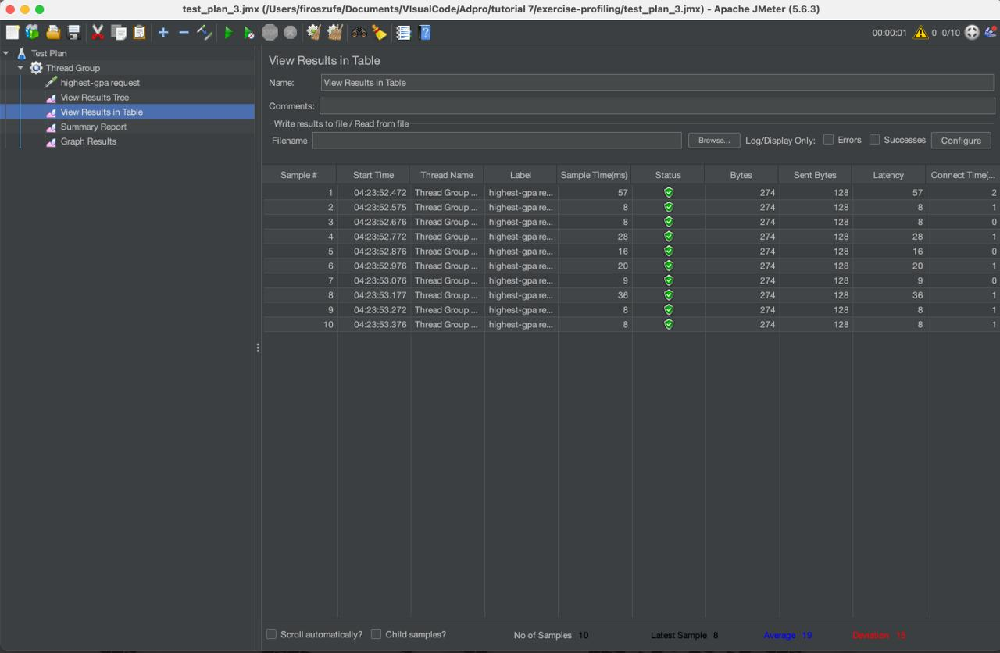
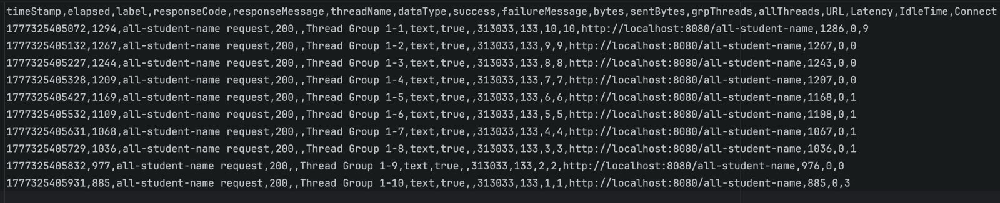
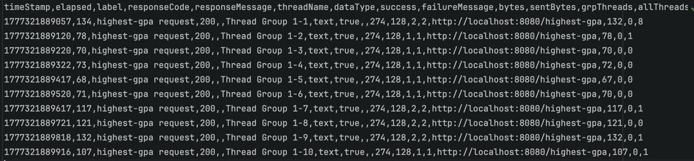

### Hasil Performance Testing
**Endpoint /all-student-name:**
1. original

2. optimized

**Endpoint /highest-gpa:**
1. original

2. optimized

**Endpoint /all-student-name: command line**

**Endpoint /highest-gpa: command line**

## Kesimpulan Performance Testing

Setelah melakukan *refactoring* kode pada `StudentService.java`, saya melakukan *performance test* menggunakan JMeter untuk membandingkan waktu eksekusi sebelum dan sesudah optimasi.

**1. Endpoint `/highest-gpa` (Method: `findStudentWithHighestGpa`)**
* **Hasil:** Rata-rata waktu eksekusi (*sample time*) turun drastis dari **~222 ms** menjadi **~24 ms** (peningkatan sekitar ~89%), membuktikan bahwa proses *sorting* dan *limiting* di tingkat database jauh lebih cepat dan efisien dibandingkan pemfilteran di tingkat aplikasi.

**2. Endpoint `/all-student-name` (Method: `joinStudentNames`)**
* **Hasil:** Rata-rata waktu eksekusi meningkat pesat dari **~1126 ms** menjadi hanya **~66 ms** (peningkatan sekitar ~94%). Hal ini menunjukkan dengan sangat jelas betapa beratnya *overhead* dari penggabungan string biasa di Java ketika menangani *dataset* yang besar, dan bagaimana `StringBuilder` menyelesaikan *bottleneck* tersebut.

**Kesimpulan:**
Dengan mendelegasikan pemfilteran data ke database dan menggunakan struktur memori yang efisien untuk manipulasi string, kedua endpoint tersebut berhasil mencapai peningkatan performa yang jauh melampaui target awal sebesar 20%.